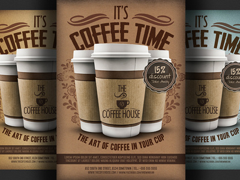
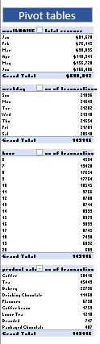
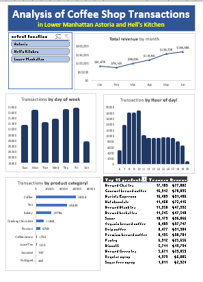

# Analysis-of-Coffee-Shop-Transactions

---
## Introduction/Project Overview
The primary objective of this project is to analyze the transaction data from three coffee shops located in **_Lower Manhattan, Astoria and Hell's Kitchen_**. 
By examining this data, we aim to identify trends in customer purchases, popular products, pricing strategies, and the overall sales performance of each store. 
This analysis will provide valuable insights into customer preferences and help inform future business strategies to enhance customer satisfaction and drive sales growth.
---
## Data Source
Coffee Shop Sales raw file.xlsx: This dataset used for this analysis contains detailed transaction records from a coffee shop, including transaction IDs, dates, times, quantities, store locations, product IDs, unit prices, product categories, product types, and product details. The data covers transactions from multiple store locations from January to June 2023. The dataset was provided as an excel file by the company
---
## Data Description
The dataset comprises detailed transaction records from three coffee shops over a specified period. The data includes the following columns:
•	transaction_id: A unique identifier for each transaction.
•	transaction_date: The date when the transaction took place.
•	transaction_time: The exact time the transaction occurred.
•	transaction_qty: The quantity of items purchased in the transaction.
•	store_id: An identifier for the store where the transaction was made.
•	store_location: The location of the store 
•	product_id: A unique identifier for each product sold.
•	unit_price: The price per unit of the product.
•	product_category: The category to which the product belongs (e.g., Coffee, Tea, Bakery).
•	product_type: A specific type of product within the category (e.g., Gourmet brewed coffee, Brewed Chai tea).
•	product_detail: Additional details about the product (e.g., Ethiopia Rg, Spicy Eye Opener Chai Lg).
This dataset provides a comprehensive view of the sales transactions, allowing for in-depth analysis of purchasing patterns and product performance across different store locations. By leveraging this data, we can uncover actionable insights to optimize product offerings, improve customer experience, and enhance overall business operations
---
## Problem Statement
1.	Total Sales by Product Category: Summarizing total sales for each product category.
2.	Total Revenue by Store Location: Calculating the total revenue generated by each store location.
3.	Sales Trends Over Time: Analyzing sales data over time to identify trends.
4.	Transactions by day of the week and hour of the day	
5.	Total Sales by Product Category: Determine the total sales for each product category 
6.	Total Revenue by Product Category: Calculate the total revenue generated by each product category.
7.	Total Revenue by Store Location: Calculate the total revenue generated by each store location 
8.	Total Revenue by Product Type: Determine the total revenue generated by each product type
9.	Top 15 products by transaction and revenue
10.	Hourly Sales Trends: Analyze sales trends by hour to identify peak times for transactions.
15.	Sales Trends Over the Day: Identify how sales vary throughout the day.
16.	Revenue Trends Over the Day: Identify revenue trends throughout the day.
---
## Skills/Concepts Demostrated
**Data Cleaning and Preparation**
- Data Filtering and Sorting
-	Conditional Formatting
-	Text Functions
-	Date and Time Functions
-	Data Validation
**Data Analysis**
-	Pivot Tables
-	Pivot Charts: 
- 	Formulas and Functions
**Visualization**
-  Charts and Graphs
-  Slicers and Timelines
-  Advanced Analysis
**Reporting and Dashboarding**
-  Dashboard Creation
---
## Data Cleaning/Transformation
In the initial data preparation phase, we performed the following task: 
1.	Added a column for Revenue using the operator 	=D2*H2
2.	Added a column for month using 			=MONTH(B2)
3.	Added a column for monthName using 		=TEXT(B2,"mmm")
4.	Added a column for weekday using 			=WEEKDAY(B2,2)
5.	Added a column for weekdasyName using 		=TEXT(B2,"ddd") 
6.	Added a column for Hour using 			=HOUR(C2)

## Analysis and Summaries with Pivot Tables

1. Total Revenue per Month
- Rows: Month
- Values: Sum of unit_price * transaction_qty
- This analysis will show the total Revenue revenue generated in each Month.
2. Total Transaction per Day of Week
- Rows: weekdayName
- Values: Count of Transaction_id
- This analysis will show the count of transactions each week day.
3. Total Transaction by hour of Day
- Rows: Hour
- Values: Count of Transaction_id
- This analysis will show the count of transactions each week day.
4. Total Transaction per product category
- Rows: product_category
- Values: Count of Transaction_id
- This analysis will show the count of transactions per product_category sorted descending by transaction
5. Number of transactions and revenue by product_type sorted in descending order and filtered to the top 15(by transaction)
- Rows: product_type
- Values: Count of Transaction_id, Sum of Revenue
- This analysis will show the count of transactions and Sum of Revenue per product_type sorted descending by transaction

---
## Visualizations

---
## Result/Findings
1. The data shows a positive revenue trend from January to June, with the highest revenue recorded in June and the lowest in February. The substantial increases in revenue during the months of April to June indicate strong growth during the latter half of the observed period. The average monthly revenue is around $116,469, and overall, the revenue trend is upward, suggesting a period Revenue increased consistently from January to June, with significant growth noted particularly in May and June. of financial growth.
2. The data shows a fairly even distribution of transactions throughout the week, with a slight dip on Saturday. Friday sees the highest number of transactions, followed by Thursday and Monday. The weekend days, Saturday and Sunday, have fewer transactions compared to weekdays. The average number of daily transactions is around 21,302, indicating a consistent level of activity throughout the week with minor fluctuations. The overall trend suggests that transactions are slightly higher during weekdays, with a peak on Friday and a low on Saturday.
3. The data shows a clear peak in transactions during the morning hours, with the highest activity occurring at 10 AM. There is a steady increase in transactions from 6 AM to 10 AM, followed by a gradual decline throughout the rest of the day. The lowest number of transactions occurs at 8 PM, indicating minimal activity during late evening hours. The average number of transactions per hour is around 9,944, with a noticeable concentration of transactions in the morning and early afternoon. This pattern suggests that the busiest period is the morning, tapering off in the afternoon and evening.
4. The data shows that Coffee is the most popular product category, accounting for 39.2% of total transactions, followed by Tea at 30.5%. These two categories together make up nearly 70% of all transactions. Bakery products also see a significant number of transactions, contributing 15.3% to the total. Other categories, such as Drinking Chocolate, Flavours, Coffee beans, Loose Tea, Branded, and Packaged Chocolate, have much lower transaction counts, with Packaged Chocolate being the least popular.

This distribution indicates a strong preference for beverages, particularly Coffee and Tea, among customers. Bakery products also enjoy a fair share of transactions, but the remaining categories have a much smaller customer base. The focus on beverages and baked goods suggests these are key drivers of sales, with other products being supplementary.
5. The data suggests a strong preference for various types of brewed beverages, particularly coffee and tea, which are not only popular but also contribute significantly to overall revenue. Bakery items also perform well, indicating their role in complementing beverage sales.
## Recomendations

Enhance Focus on Popular Products:

Coffee and Tea: These categories have the highest number of transactions. Expanding the range of coffee and tea offerings or introducing premium and specialty variants could further boost sales.
Barista Espresso: Given its high revenue per transaction, promoting this product through targeted marketing campaigns and loyalty programs could be beneficial.
Optimize Product Pricing:

Evaluate the pricing strategy for products like Hot Chocolate and Barista Espresso, which have high average transaction values. Ensuring competitive pricing while maintaining high margins can attract more customers.
Consider pricing adjustments or bundling for lower-performing products like Syrups to increase their appeal.
Expand and Promote Bakery Products:

Scones and Pastries: These items have a good number of transactions and decent revenue. Introducing new flavors or limited-time offerings can attract repeat customers.
Cross-promote bakery items with popular beverages to increase average transaction values.
Leverage Peak Hours and Days:

Morning Hours (8-10 AM): These are peak transaction times. Offering special promotions or discounts during these hours can maximize sales.
Fridays and Mondays: High transaction days. Implementing end-of-week and start-of-week promotions can capitalize on these peak days.
Improve Low-Performing Products:

Sugar Free Syrup and Regular Syrup: Consider revising these products. Introduce new flavors or market them as healthier alternatives to attract health-conscious customers.
Analyze the reasons behind low transactions for products like Packaged Chocolate and Branded items, and consider repositioning or discontinuing them if they do not align with customer preferences.
Customer Loyalty and Retention Programs:

Implement loyalty programs that reward frequent customers, especially for high-performing products like Brewed Chai tea and Gourmet brewed coffee.
Offer exclusive deals or early access to new products for loyal customers.
Marketing and Promotion Strategies:

Targeted Marketing: Use data-driven insights to target specific customer segments with personalized offers. For example, coffee lovers could be targeted with promotions on Gourmet brewed coffee and Barista Espresso.
Seasonal Promotions: Introduce seasonal flavors and limited-time offers to create excitement and urgency among customers.
Enhance Customer Experience:

Streamline Operations During Peak Times: Ensure adequate staffing and efficient processes during peak hours and days to reduce wait times and improve customer satisfaction.
Feedback Mechanism: Implement a robust feedback system to understand customer preferences and areas for improvement, particularly focusing on why certain products may have lower transactions.
New Product Development:

Based on the popularity of certain products, consider developing new variations. For example, flavored hot chocolates or innovative tea blends.
Test new bakery items or snacks that pair well with popular beverages to boost overall sales.
Technology and Automation:

Invest in technology to better analyze sales data and customer preferences, enabling more informed decision-making.
Consider implementing self-service kiosks or mobile ordering to streamline the purchasing process during busy periods.
By leveraging these insights and recommendations, the company can enhance its product offerings, optimize pricing strategies, and improve overall customer satisfaction and sales performance. 😄

